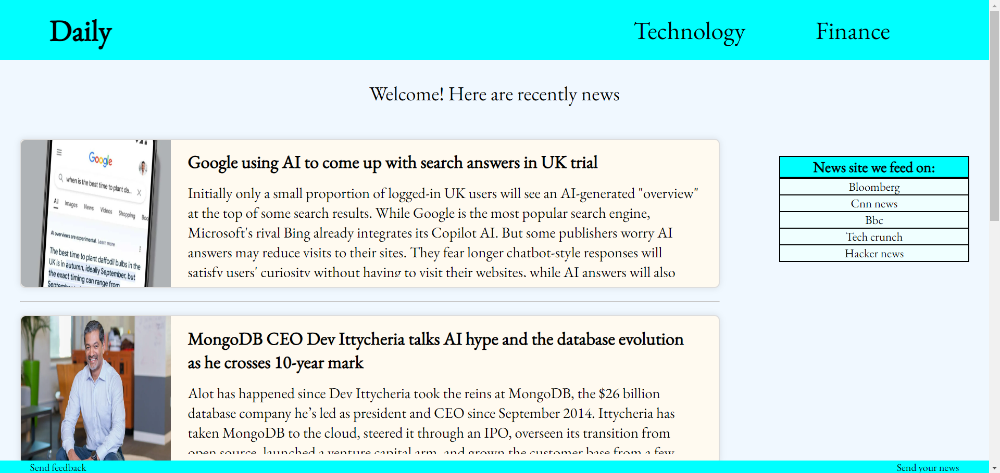

Daily is a news site that stands out with its simple design, where daily news is shared or (in later stages) news from selected sources is shown, and its areas of concentration are finance and technology.

Users can easily read the news and see the source and author without logging in. There is also a news creation page for news that users want to be shared. After admin approval, the news created to be added to 
the page waits in the admin panel.
I am thinking of adding news directly to this site on selected news sites with web-scraping in the future.


## Installation

### Steps

1. **Clone the repository**:

    Open your terminal or command prompt and run the following command to clone the repository from GitHub:

    ```bash
    git clone https://github.com/ismailerd1/Daily.git
    cd news-website
    ```

2. **Create and activate a virtual environment**:

    It is recommended to use a virtual environment to manage dependencies. Run the following commands to create and activate a virtual environment:

    - For macOS/Linux:

      ```bash
      python3 -m venv venv
      source venv/bin/activate
      ```

    - For Windows:

      ```bash
      python -m venv venv
      venv\Scripts\activate
      ```

3. **Install the required dependencies**:

    Use `pip` to install the dependencies listed in the `requirements.txt` file:

    ```bash
    pip install -r requirements.txt
    ```
4. **Superuser**:

    superuser for usage:
    	username: gitguest
    	e-mail: fromgithub@gmail.com
    	password: dailynews11


5. **Start the development server**:

    Finally, start your Django development server using the following command:

    ```bash
    python manage.py runserver
    ```

	Application should now be running at [http://localhost:8000](http://localhost:8000).


## Screenshots

Here is a screenshot of the application:




### CONTACT

I'm new here. I would be happy for you to share your thoughts with me and if there are any mistakes, omissions or problems.

e-mail: ismailerdogan2003@gmail.com

